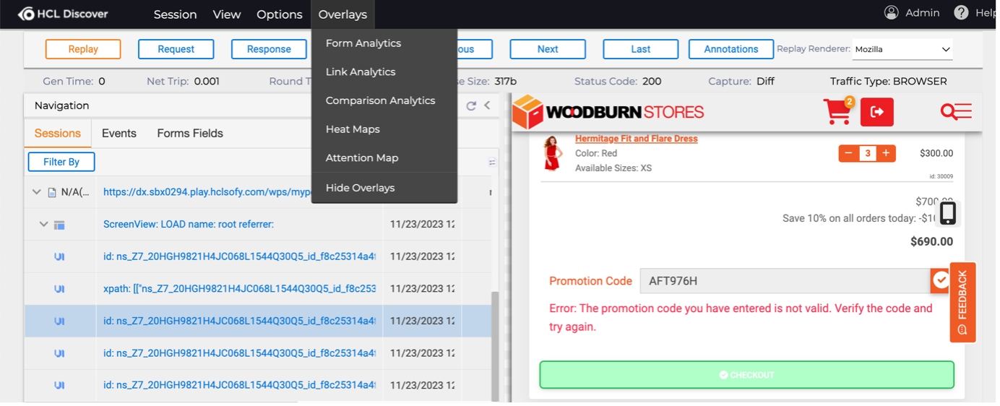

# Sample for integrating HCL Discover into HCL Digital Experience (DX)

This is a working sample demonstratng how to integrate Discover into DX.

# Why use HCL Discover and HCL Digital Experience together?
- Deliver frictionless and personalized experiences that delight your customers and attain your business targets
- Provides enhanced online customer experiences for improved customer experience and loyalty 
- Quantitative data and qualitative experience information necessary to understand customers' TRUE digital experiences 
- Improved performance across digital web channels (e.g. desktop, mobile, and tablet) 
- Proactive Struggle detection and address user struggles in real time
- Business Impact and Opportunity Analysis
- Browsing Behaviors Analytics
- Live Session Replay
- Improve user experience, by capturing and analyzing behavioral data
- Obtain visibility into business impact and opportunities

Here you see a user's sesion with a struggle in DX replayed in Discover:

# Learn how to use
Use the following HCLSoftware U course [HDE-INT-HDX HCL Discover Integration with HCL Digital Experience](https://hclsoftwareu.hcltechsw.com/courses/course/hde-int-hdx-hcl-discover-integration-with-hcl-digital-experience) to see how the integration works for the following personas (you need to sign up and log in first to access these lessons)

- [Business Users](https://hclsoftwareu.hcltechsw.com/component/axs/?view=sso_config&id=3&forward=https%3A%2F%2Fhclsoftwareu.hcltechsw.com%2Fcourses%2Flesson%2F%3Fid%3D956) - how to use
- [Administrators](https://hclsoftwareu.hcltechsw.com/component/axs/?view=sso_config&id=3&forward=https%3A%2F%2Fhclsoftwareu.hcltechsw.com%2Fcourses%2Flesson%2F%3Fid%3D1228) - deploy and secure

More information in the [Help Center](https://opensource.hcltechsw.com/digital-experience/latest/build_sites/site_analytics/unica/)

# Support
This sample is provided AS-IS. 

Please reach out to HCLSoftware lab services to get this implemented on a production environment.
